# VORTEX APEX (VORTEX-AC) — Advanced Forensic Intelligence Suite

```text
 +-----------------------------------------------------------------------------+
 |  __      __ ____   _____   _______  ______  __   __                         |
 |  \ \    / // __ \ |  __ \ |__   __||  ____| \ \ / /                         |
 |   \ \  / /| |  | || |__) |   | |   | |__     \ V /   APEX ANTI-CHEAT        |
 |    \ \/ / | |  | ||  _  /    | |   |  __|     > <    FORENSIC SUITE         |
 |     \  /  | |__| || | \ \    | |   | |____   / . \   (VORTEX-AC)            |
 |      \/    \____/ |_|  \_\   |_|   |______| /_/ \_\  Coded By BayrdY        |
 +-----------------------------------------------------------------------------+
               ADVANCED ANTI-CHEAT & FORENSIC SUITE (VORTEX-AC)
           [ SYSTEM ARCHITECTURE & CORE ENGINE : CODED BY BAYRDY ]
            [ SECURITY RESEARCH & SIGNATURES : BAYRDY LABS 2026 ]
```

[](https://microsoft.com/PowerShell)
[](https://microsoft.com/windows)
[](https://dotnet.microsoft.com)
[]()
[]()

---

## ⚡ Quick Start — Zero-Install Execution

VORTEX APEX is engineered as a **100% standalone, zero-dependency payload**. You do not need to clone repositories or manually download files. Run it directly inside an **Administrator** console:

### 🔹 PowerShell (Run as Administrator)
```powershell
irm https://raw.githubusercontent.com/USERNAME/REPO_NAME/main/UltimateAntiCheat.ps1 | iex
```
*(Short alias: `iwr -useb https://raw.githubusercontent.com/USERNAME/REPO_NAME/main/UltimateAntiCheat.ps1 | iex`)*

### 🔹 Command Prompt / CMD (Run as Administrator)
```cmd
powershell -NoProfile -ExecutionPolicy Bypass -Command "irm https://raw.githubusercontent.com/USERNAME/REPO_NAME/main/UltimateAntiCheat.ps1 | iex"
```

> ⚠️ **Privilege Requirement**: Administrator privileges are strictly enforced. The engine uses kernel-level queries, unencrypted physical memory descriptors, NTFS USN journals, and privileged event subtrees.

---

## 📌 Executive Overview

**VORTEX APEX** is a next-generation, high-performance forensic intelligence and anti-cheat scanner purpose-built for Minecraft competitive environments and esports screensharing.

Unlike standard signature-matching tools that rely on basic file naming or slow sequential file parsing, VORTEX APEX compiles a **custom C# multithreaded inspection core** directly into memory via the CLR (`Add-Type`). It analyzes thousands of JAR archives, live JVM process heaps, Windows execution artifacts, NTFS low-level journals, and rootkit cleaner traces in **under 45 seconds**.

---

## 🔬 Core Capabilities & Forensic Engines

```mermaid
graph TD
    A[VORTEX APEX Core] --> B[Phase 1: Live Memory & JVM Forensics]
    A --> C[Phase 2: Multi-Core Bytecode Heuristics]
    A --> D[Phase 3: Windows Execution Artifacts]
    A --> E[Phase 4: NTFS Storage & Journal Deletions]
    A --> F[Phase 5: Cleaners, Kernel & Network Forensics]
    
    B --> B1[javaw.exe RAM Heap Pattern Scanner]
    B --> B2[Injected DLL & Render Hook Detection]
    
    C --> C1[1800+ JARs Scanned in Parallel]
    C --> C2[ProcessBuilder / Runtime.exec Heuristics]
    C --> C3[Commercial Obfuscator & Token Stealer Detection]
    
    D --> D1[Prefetch, BAM & UserAssist ROT13]
    D --> D2[WinRAR ArcHistory & Everything Logs]
    D --> D3[ComDlg32 Open/Save Dialog History]
    
    E --> E1[NTFS Change Journal - USN Deletions]
    E --> E2[Recycle Bin Deep Artifact Recovery]
    
    F --> F1[Defender Exclusions & Kernel Driver Audit]
    F --> F2[DNS Cache & 20+ Cheat Auth Telemetry]
    F --> F3[LUA Mouse Macros & Clipboard Inspection]
```



### 1. 🧠 Live JVM Memory & Native Hook Analysis (Phase 1)
- **Direct RAM Pattern Matching**: Reads committed memory pages of active `javaw.exe` / `java.exe` instances via Win32 `VirtualQueryEx` and `ReadProcessMemory`.
- **Dynamic Unencrypted Descriptors**: Identifies live cheat constants (`AutoCrystal`, `ReachHack`, `FastPlace`, `GrimVelocity`, `VapeLite`) even if injected via memory loaders.
- **Render Hook & DirectX Overlay Inspection**: Pinpoints unverified graphics hooks (`d3d9`, `dxgi`, `opengl32`, `RTSSHooks`) loaded from user directories to expose stream-proof ESP / Chams.

### 2. ⚡ Multi-Core Parallel Bytecode Heuristics (Phase 2)
- **High-Throughput Parallel Engine**: Leverages `Parallel.ForEach` across all CPU cores, streaming through thousands of JAR archives simultaneously without disk decompression bottlenecks.
- **Malicious Bytecode Heuristics**: Detects native OS execution (`ProcessBuilder`, `Runtime.getRuntime().exec()`), webhook token exfiltration, and socket drop routines.
- **Commercial Obfuscator Detection**: Identifies protection frameworks favored by commercial cheat developers (Zelix KlassMaster, Radon, Allatori, Stringer, Binscure).
- **Trojan Mod Spoofing**: Exposes JARs impersonating legitimate mods (`fabric-api`, `sodium`, `optifine`) while housing concealed PvP macros.

### 3. 🔍 Deep Windows Artifact Forensics (Phase 3)
- **Windows Prefetch Subsystem**: Extracts historical execution artifacts and launch frequencies from `C:\Windows\Prefetch\*.pf`.
- **Background Activity Moderator (BAM / DAM)**: Decodes persistent registry execution timelines per User SID.
- **UserAssist ROT13 Execution History**: Decodes ROT13-encrypted Explorer application launch logs.
- **ComDlg32 OpenSavePidlMRU**: Surfaces deleted cheat binaries or injectors selected through Windows file dialog pickers.
- **WinRAR & 7-Zip Archive History (`ArcHistory`)**: Recovers archive names opened prior to deletion.
- **Voidtools Everything Search History**: Exposes keyword queries (`vape`, `reach`, `disabler`, `cleaner`, `usn`) executed before the inspection.

### 4. 🗄️ Storage & Journal Deletion Forensics (Phase 4)
- **NTFS USN Journal Deletion Tracking**: Queries raw change journals using low-level Win32 control codes to detect binaries deleted seconds or days prior to the screen inspection.
- **Recycle Bin Metadata Traversal**: Inspects hidden `$Recycle.Bin` streams for purged executables and archives.

### 5. 🛡️ Cleaners, Kernel & Network Forensics (Phase 5)
- **Windows Defender Exclusion Audit**: Surfaces hidden exclusions in `ExclusionPath`, `ExclusionExtension`, and `ExclusionProcess`.
- **DNS Resolver Cache & Telemetry**: Evaluates `Get-DnsClientCache` against a curated intelligence database of 20+ cheat authentication servers (`vape.gg`, `drip.gg`, `riseclient.com`, `intent.store`, `tenacity.dev`).
- **USB Device Forensics (USBSTOR)**: Inspects device mounts for "Ghost Flash" bypass attempts where external drives are disconnected before matches.
- **Kernel Integrity & BYOVD Drivers**: Verifies `TestSigning`, `NoIntegrityChecks`, and vulnerable signed rootkit drivers (e.g. `gdrv.sys`, `mhyprot2.sys`, `capcom.sys`).
- **Hardware LUA & Macro Profiles**: Audits Logitech G HUB (`.lua`), Razer Synapse, Bloody (`.amc`), and Corsair iCUE profiles for recoil and auto-clicker scripts.
- **Live Clipboard Forensics**: Detects active webhook tokens, licensing keys, and self-destruct commands left in the clipboard buffer.

---

## 📊 Comparison Matrix

| Feature / Forensic Layer | Generic Anti-Cheats | Commercial SS Tools (Echo/Paladin) | **VORTEX APEX (BayrdY)** |
|:---|:---:|:---:|:---:|
| **Zero-Install One-Liner (`irm \| iex`)** | ❌ No | ❌ No (`.exe` installer) | ✅ **100% Native PowerShell & C#** |
| **Multi-Core Bytecode Engine** | ❌ Slow Sequential | ⚠️ Partial | 🚀 **1800+ JARs in <40 Seconds** |
| **Live RAM Descriptors (`javaw.exe`)** | ❌ No | ✅ Yes | 🚀 **Win32 Memory Page Extraction** |
| **DirectX / GPU Overlay Hooks** | ❌ No | ⚠️ Generic DLLs | 🚀 **Hook & Stream-Proof Detection** |
| **NTFS USN Change Journal** | ❌ No | ✅ Yes | 🚀 **Raw Journal Querying** |
| **Windows Defender Exclusions** | ❌ No | ❌ No | 🚀 **Full Exclusion Subsystem Audit** |
| **DNS Resolver Cache Telemetry** | ❌ No | ⚠️ Partial | 🚀 **20+ Cheat Auth Endpoints** |
| **WinRAR / 7-Zip ArcHistory** | ❌ No | ⚠️ Partial | 🚀 **Registry Archive Traversal** |
| **LUA & Hardware Mouse Macros** | ❌ No | ❌ No | 🚀 **Logitech, Razer, Bloody, iCUE** |
| **Offline Multi-Language Dashboard** | ❌ English Only | ❌ English Only | 🚀 **Instant Offline Turkish Auto-Translate** |

---

## 🖥️ Interactive Web Dashboard & Telemetry Report

Upon scan completion, VORTEX APEX generates a standalone, cyberpunk-themed HTML report saved directly to the user's Desktop:

- **Threat Score Gauge (0–100)**: Real-time risk weighting calculated across Critical, High, and Medium anomalies.
- **Instant Client-Side Auto-Translation**: Evaluates `navigator.language` on launch, translating findings, technical bytecode descriptions, and controls into native Turkish with zero network requests.
- **Dynamic Category & Severity Filtering**: Filter by Bytecode, Memory, Forensics, Cleaners, Security & Kernel, and Network.
- **Mod Inventory Table**: Complete catalogue of scanned JAR archives with SHA-1 hashes, file sizes, mod IDs, and clean/suspicious statuses.
- **JSON Telemetry Export**: One-click export for staff records and team review.
- **Discord Webhook Relay**: Optional automated embed posting directly into staff Discord channels.

---

## ⚙️ Command-Line Parameters

When executing locally or embedding into custom inspection pipelines:

```powershell
.\UltimateAntiCheat.ps1 [-TargetFolder <Path>] [-FullScan] [-NoHtmlReport] [-DiscordWebhook <URL>]
```

| Parameter | Type | Description |
|:---|:---|:---|
| `-TargetFolder` | `string` | Custom path to a directory or Minecraft instance for targeted mod scanning. |
| `-FullScan` | `switch` | Enables deep volume traversal across all local fixed drives. |
| `-NoHtmlReport` | `switch` | Suppresses HTML report generation; displays console verdict only. |
| `-DiscordWebhook`| `string` | Webhook endpoint to transmit embedded scan verdicts and telemetry. |

---

## 🔒 Security Architecture & Anti-Tamper

VORTEX APEX employs multi-tiered anti-tamper safeguards:
- **Functional Binding**: Core native namespaces (`VortexCore_BayrdY`, `FastScanner`, `Win32`) are strictly bound to execution routines.
- **Polymorphic Watermarking**: Over 25 distinct multi-layer signatures across C# compilation units, PowerShell runtime routines, DOM pseudo-elements, and Base64 decoders.
- **QuickEdit Console Protection**: Automatically disables Windows console QuickEdit mode via Win32 `SetConsoleMode` to prevent accidental mouse click freezes during scans.

---

## 👤 Author & Credits

- **System Architect & Lead Developer**: **BayrdY**
- **Engine**: VORTEX Core Engine (VORTEX-AC 2026)
- **License**: Proprietary / Esports Forensic License — Designed for competitive integrity.

```text
VORTEX APEX (VORTEX-AC) • ADVANCED FORENSIC INTELLIGENCE SUITE • Coded By BayrdY
```
